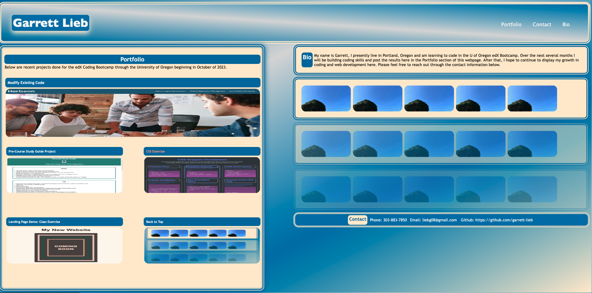

# challenge-week-2-portfolio

## Description

This is the intial stage of a portfolio site developed from no existing body of code by a student in the edX Coding Bootcamp at the University of Oregon. The site contains functioning links to other completed, deployed pages that were created during class and as independant work to this point in the course program. The site was developed to help students utilize new and established skills in HTML and CSS and will be built upon as the course work continues to provide a foundation for exhibiting their work(s) for potential future employers and further education opportunities.  The site began with rudimentary visual effects on links and elements that will be built upon as students gain knowledge about web devlopment.

[ DEPLOYED PAGE: 
    https://garrett-lieb.github.io/challenge-week-2-portfolio/]

[ Garrett Lieb GITHUB REPO: 
    https://github.com/garrett-lieb/challenge-week-2-portfolio]

## Installation

N/A

## Usage

This website contains alt descriptors and the HTML and CSS are visible when the Chrome DevTools are opened by pressing Command+Option+I (macOS) or Control+Shift+I (Windows.)

## Credits

N/A

## Liscence

MIT Liscence

Copyright (c) 2023 Garrett Lieb

Permission is hereby granted, free of charge, to any person obtaining a copy of this software and associated documentation files (the "Software"), to deal in the Software without restriction, including without limitation the rights to use, copy, modify, merge, publish, distribute, sublicense, and/or sell copies of the Software, and to permit persons to whom the Software is furnished to do so, subject to the following conditions:

The above copyright notice and this permission notice shall be included in all copies or substantial portions of the Software.

THE SOFTWARE IS PROVIDED "AS IS", WITHOUT WARRANTY OF ANY KIND, EXPRESS OR IMPLIED, INCLUDING BUT NOT LIMITED TO THE WARRANTIES OF MERCHANTABILITY, FITNESS FOR A PARTICULAR PURPOSE AND NONINFRINGEMENT. IN NO EVENT SHALL THE AUTHORS OR COPYRIGHT HOLDERS BE LIABLE FOR ANY CLAIM, DAMAGES OR OTHER LIABILITY, WHETHER IN AN ACTION OF CONTRACT, TORT OR OTHERWISE, ARISING FROM, OUT OF OR IN CONNECTION WITH THE SOFTWARE OR THE USE OR OTHER DEALINGS IN THE SOFTWARE.